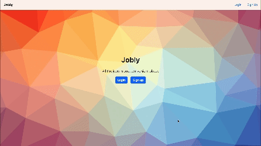

<a name="readme-top"></a>
<div align="center">

  <h1 align="center">Jobly</h1>

  <p align="center">
    "Discover Your Next Job: Every Opportunity, One Easy Platform."
    <br />
    <br />
    <!-- To start a screen record on Mac: Shift + Cmd + 5 -->
    
    <br />
    <br />
    <a href="https://jia-jobly.onrender.com" target="_blank">View Demo</a>
    <a href="https://github.com/jgan21/express-jobly" target="_blank">Jobly Backend Repo</a>
  </p>
</div>
<div align="center">


</div>

<!-- TABLE OF CONTENTS -->
<details>
  <summary>Table of Contents</summary>
  <ol>
    <li>
      <a href="#about-the-project">About The Project</a>
      <ul>
        <li><a href="#learnings">Learnings</a></li>
        <li><a href="#built-with">Built With</a></li>
      </ul>
    </li>
    <li>
      <a href="#getting-started">Getting Started</a>
    </li>
    <li><a href="#usage">Usage</a></li>
    <li><a href="#roadmap">Roadmap</a></li>
<!--     <li><a href="#contributing">Contributing</a></li> -->
<!--     <li><a href="#license">License</a></li> -->
    <li><a href="#contact">Contact</a></li>
    <li><a href="#acknowledgments">Acknowledgments</a></li>
  </ol>
</details>

<!-- ABOUT THE PROJECT -->

## About The Project

Jobly is a job board site. Users are able to sign up, log in, browse companies, and apply for jobs. This project was originally built in January 2024 during a 4-day sprint at [Rithm School](https://www.rithmschool.com/).

Jobly is a full-stack Javascript application and was built with a React frontend that uses Bootstrap for styling and deployed through Render. For the backend, it uses Express with Postgres database. The deployed backend is hosted on [Render](https://render.com/) and the database is hosted on [ElephantSQL](https://www.elephantsql.com/).

This repo is the frontend but you can find the backend code [here](https://github.com/jgan21/jobly-backend).

You can log into the [demo site](https://jia-jobly.onrender.com/) with the following credentials:
- Username: `guest`
- Password: `password`

### Learnings

This project offered learning opportunities around:

Frontend:
- React component design
- React state management and context
- React Router
- Token retrieval via localStorage
- Implementing debounce method on search bar

Backend:

- Authentication and authorization with middleware and JWT tokens
- Protection against SQL injection attacks via parameterized queries
- Building RESTful APIs
- Form validation with JSON schemas
- Test-driven development and coverage
- Bcrypt hashing

## Component Hierarchy Design


<p align="right">(<a href="#readme-top">back to top</a>)</p>

### Built With

Frontend:
- ![React][React]
- ![React Router][React Router]
- ![Render][Render]

Backend:
- ![Node.js][Node.js]
- ![Express][Express]
- ![PostgreSQL][PostgreSQL]
- ![ElephantSQL][ElephantSQL]
- ![Render][Render]

<p align="right">(<a href="#readme-top">back to top</a>)</p>

<!-- GETTING STARTED -->

## Getting Started

To get a local copy up and running, please follow these steps.

1. Follow the instructions for cloning and setting up the [backend repo]((https://github.com/jgan21/jobly-backend)).
2. In a new terminal, clone the frontend repo.
   ```sh
   git clone https://github.com/jgan21/react-jobly.git
   ```
3. Install frontend dependencies.
    ```sh
    npm install
    ```
4. Run the app in the development mode.
    ```sh
    npm start
    ```
  Open [http://localhost:3000](http://localhost:3000) to view it in your browser.


<p align="right">(<a href="#readme-top">back to top</a>)</p>

<!-- ROADMAP -->

## Roadmap

- [ ] Add user profile page with options to edit profile
- [ ] Add a "forgot password" feature
- [ ] Add feature to allow users to apply for jobs

<p align="right">(<a href="#readme-top">back to top</a>)</p>

<!-- CONTRIBUTING -->

<!-- LICENSE -->


<!-- CONTACT -->

## Contact
[LinkedIn](https://www.linkedin.com/in/jia-rong-gan/)

Project Link (Frontend): [https://github.com/jgan21/react-jobly](https://github.com/jgan21/react-jobly)

Project Link (Backend): [https://github.com/jgan21/jobly-backend](https://github.com/jgan21/jobly-backend)

Live Demo: [https://jia-jobly.onrender.com/](https://jia-jobly.onrender.com/)

<p align="right">(<a href="#readme-top">back to top</a>)</p>

<!-- ACKNOWLEDGMENTS -->

## Authors
* [Brandie Lucano](https://github.com/BMLucano) : Frontend Co-author
* [Seth Hobson](https://github.com/Seth-Lawrence/express-jobly): Backend Co-author

## Acknowledgments

This project was completed at [Rithm School](https://www.rithmschool.com/). Many thanks to Brandie Lucano, Seth Hobson, and Rithm's staff team for their support!

- [Rithm School](https://www.rithmschool.com/)
- [Best-README-Template](https://github.com/othneildrew/Best-README-Template)
- [Img Shields](https://shields.io)

<p align="right">(<a href="#readme-top">back to top</a>)</p>

<!-- TECHNOLOGY BADGES -->

[React]: https://img.shields.io/badge/React-61DAFB?logo=react&logoColor=white
[React Router]: https://img.shields.io/badge/React_Router-CA4245?logo=react-router&logoColor=white
[Bootstrap]: https://img.shields.io/badge/Bootstrap-563D7C?style=for-the-badge&logo=bootstrap&logoColor=white
[Express]: https://img.shields.io/badge/Express-000000?logo=express&logoColor=white
[Node.js]: https://img.shields.io/badge/Node.js-339933?logo=node.js&logoColor=white
[PostgreSQL]: https://img.shields.io/badge/PostgreSQL-4169E1?logo=postgresql&logoColor=white
[ElephantSQL]: https://img.shields.io/badge/ElephantSQL-2D9CDB?logo=elephantsql&logoColor=white
[Render]: https://img.shields.io/badge/Render-000000?logo=render&logoColor=white